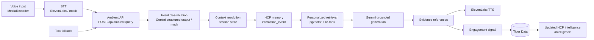
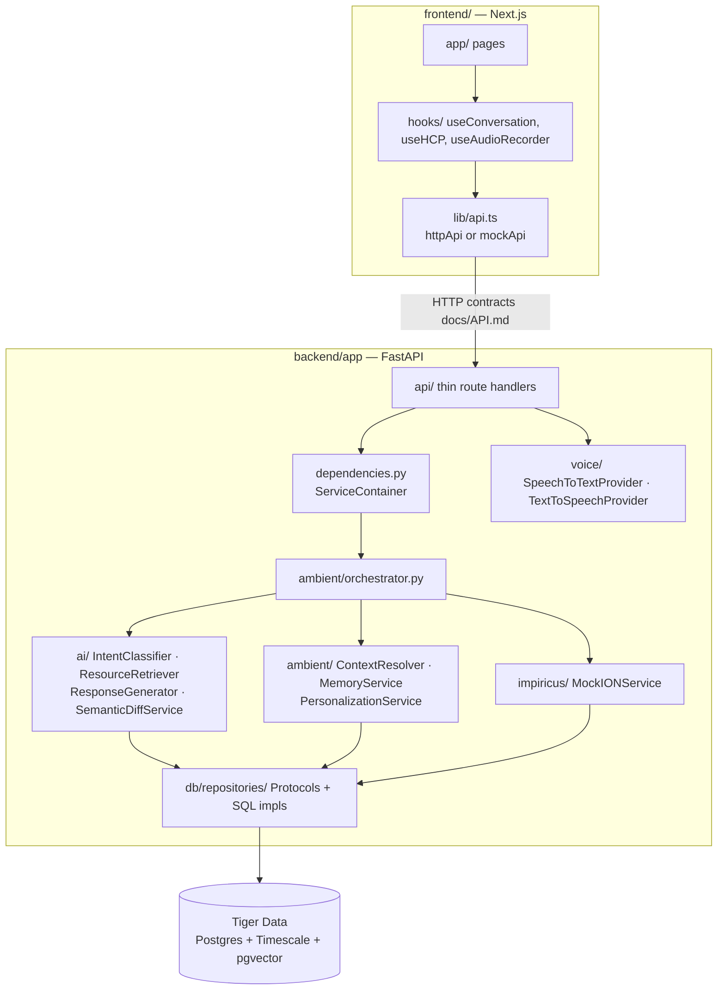

# Architecture

> Hackathon prototype. Synthetic HCPs, fictional products, no patient data.

## The Ambient loop

## Layers and ownership

Rules that keep the workstreams decoupled:

- **Route handlers are thin.** They validate input and call one service. The whole pipeline lives in
  `AmbientOrchestrator.process_query`.
- **Everything external is behind a Protocol** with a real and a mock implementation:
  `IntentClassifier`, `EmbeddingProvider`, `ResourceRetriever`, `ResponseGenerator`, `SemanticDiffService`,
  `SpeechToTextProvider`, `TextToSpeechProvider`, `IONService`, and the repositories in
  `db/repositories/interfaces.py`.
- **Repositories return Pydantic schemas, never ORM rows**, so services are testable with the
  in-memory fakes in `backend/tests/fakes.py`.
- **`dependencies.py` is the only place that chooses implementations**, based on `Settings`
  (`USE_MOCK_AI`, `USE_MOCK_VOICE`, and whether keys are present).
- **Configuration lives in `app/config.py`** (backend) and `frontend/lib/env.ts` (frontend). Model IDs,
  voice IDs and the embedding dimension are never hardcoded elsewhere.

## Orchestrator steps

`AmbientOrchestrator.process_query(hcp_id, session_id, query, input_mode)`:

| # | Step | Service |
|---|------|---------|
| 1 | Load HCP profile, preferences, interests, recent events | `IONService.get_hcp_context` |
| 2 | Load or create the conversation session | `ConversationRepository` |
| 3 | Classify intent + extract entities (structured JSON) | `IntentClassifier` |
| 4 | Resolve references ("what about renal impairment?" → Novara) | `ContextResolver.resolve` |
| 5 | Load last *review* of the active entity | `MemoryService.get_last_review_of_entity` |
| 6 | Pick strategy (`SEMANTIC`, `WHATS_NEW`, `HISTORY_ONLY`, `SOURCE_LOOKUP`) | `ContextResolver` |
| 7 | WHATS_NEW: find newer resources + diff superseded versions | `MemoryService.whats_new`, `SemanticDiffService` |
| 8 | Retrieve + re-rank chunks | `ResourceRetriever` |
| 9 | Generate grounded answer (text + speech_text + citations) | `ResponseGenerator` |
| 10 | Store user + assistant turns | `ConversationRepository.add_turn` |
| 11 | Build signals, update interest scores | `PersonalizationService` → `IONService.record_signal` |
| 12 | Record the engagement event (with signals in metadata) | `InteractionRepository.record` |
| 13 | Persist new conversation context, return `AmbientResponse` | `ContextResolver.next_context` |

### "What's changed since I last looked at it?"

1. Intent `WHATS_NEW`, entity `Novara` (or taken from session context).
2. `last_with_entity(hcp, "Novara", event_types={RESOURCE_VIEW, SOURCE_OPEN, RESOURCE_SAVED})`.
   Only *reviewing* material counts as "looking at it". Asking a question does not, so the demo can
   be repeated until the HCP actually opens a source.
3. `published_after(product, timestamp)` → new resources (PI v2, Trial A long-term follow-up).
4. Each new resource that `supersedes` an older one is diffed (PI v1 → v2: renal impairment updated).
5. Retrieval is limited to resources published after that timestamp, and the query is steered toward
   the changed sections and the HCP's top interests.
6. The generator summarizes using only that evidence.

## Grounding guarantees

- The generator only gets retrieved, approved passages. The prompt forbids unsupported claims
  (`ai/prompts.py`).
- Structured output (`GeneratedAnswer`) separates `text`, `speech_text`, `cited_evidence_ids`
  and `insufficient_evidence`.
- Guardrail: if there is no evidence, `insufficient_evidence` is forced on, and cited IDs are filtered to
  evidence that actually exists.
- Superseded resource versions are excluded from retrieval unless the intent is `COMPARE`.
- Personal memory is **structured SQL over events** (`ambient/memory.py`), not an LLM transcript dump.

## Why Tiger Data

One PostgreSQL-compatible datastore covers all three data shapes the product needs:

| Need | Feature | Where |
|------|---------|-------|
| Relational HCP state (profiles, preferences, interests, sessions, resources) | Plain Postgres tables | `hcp`, `hcp_interest`, `resource`, `conversation_*` |
| Temporal engagement history ("since I last looked", timelines, engagement over time) | Timescale **hypertable** + `time_bucket` + continuous aggregate | `interaction_event`, `hcp_topic_engagement_daily` |
| Semantic retrieval | **pgvector** `vector(768)` + HNSW cosine index | `resource_chunk.embedding` |

A single datastore means a single transaction can record an event, update an interest score and read
vectors. There is no sync job between a vector DB, a time-series DB and an OLTP DB, and one
`DATABASE_URL` works against Tiger Data cloud or the local `timescaledb-ha` container. The app
**degrades gracefully** on plain Postgres: the hypertable conversion and continuous aggregate are skipped,
and `time_bucket` falls back to `date_trunc`. pgvector is still required.

## Observability

`app/observability.py` emits one JSON log line per request (`request_id`, path, status, latency) and per
timed operation (`ambient.total`, `retrieval.vector_search`, `gemini.intent`, `gemini.generate`,
`elevenlabs.tts`, `elevenlabs.stt`, `semantic_diff`, …) with `session_id` attached. Per-request timings are
also returned in `AmbientResponse.timings_ms`, which is enough to build a demo latency panel. Secrets and
audio bytes are never logged.

## Mock-first

| Flag | Effect |
|------|--------|
| `USE_MOCK_AI=true` (or no `GOOGLE_API_KEY`) | Keyword intent classifier, hashed bag-of-words embeddings (real cosine similarity in pgvector), template generator, section-level diff |
| `USE_MOCK_VOICE=true` (or no `ELEVENLABS_API_KEY`) | STT returns `MOCK_STT_TEXT`; TTS returns a short silent WAV with `X-TTS-Placeholder: true` |
| `NEXT_PUBLIC_USE_MOCK_API=true` | Frontend uses `lib/mockApi.ts` fixtures, so no backend is needed |

Embeddings from the mock provider and from Gemini live in different vector spaces. **Re-run `make seed`
after switching `USE_MOCK_AI`.**
